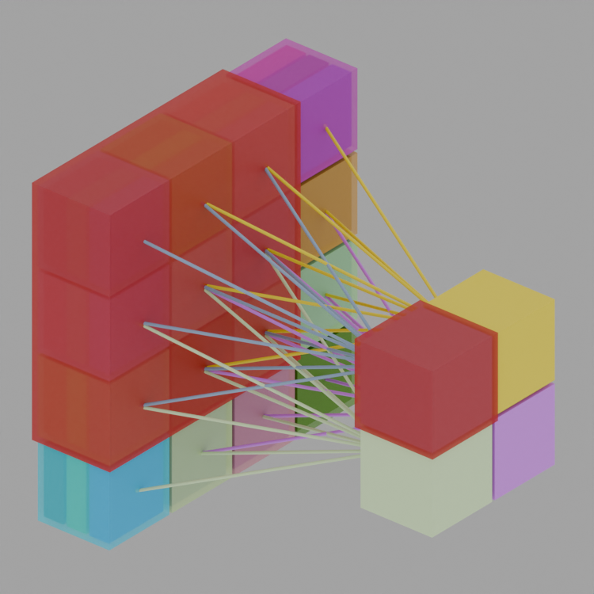

# Blending:
### Visualization of Neural Network Concepts in Blender

## Introduction
Blending is a collection of Python scripts for Blender that programmatically create 3D scenes to visualize concepts 
in neural networks, specifically focusing on convolution and pooling operations. This project aims to provide an 
educational tool for understanding these concepts through visual aids created within Blender. 

## Citation
If you use Blending in your research or project, please consider citing it. Here's an example of how you might cite it:

Mohamed Yahya Maad. 2023. Blending: Visualization of Neural Network Concepts in Blender. [Online]. 
Available: https://github.com/mmaad18/blending

## Features
- Creation of RGB cubes to represent data inputs.
- Visualization of convolution and pooling processes in neural networks.
- Customizable materials, camera setup, and lighting configuration.
- Modular Python scripts for easy modification and extension.

## Installation
1. Clone the repository or download the source code.

    git clone https://github.com/mmaad18/blending.git

2. Install Blender (Version 4.0.x or later recommended).
3. Open Blender and navigate to `Scripting`.
4. Load the Python scripts from the `blending` directory.

## Usage
The project consists of several Python scripts that can be executed within Blender's Scripting environment. The primary scripts are:

- `basic_geometry.py`: Contains functions to create basic geometric shapes, materials, and lights.
- `convolution.py`: Sets up a scene to visualize the convolution operation.
- `pooling.py`: Sets up a scene to visualize the pooling operation.
- `color_channels.py`: Demonstrates the creation of RGB cubes and other basic elements.

**To run a script:**
1. Open the script in Blender's Text Editor.
2. Press `Run Script` to execute and visualize the scene.

## Customization
You can customize the scenes by modifying parameters in the script, such as the dimensions of the cubes, colors, and camera angles.

## License
This project is open-source and available under the [GNU GPL License](https://www.gnu.org/licenses/#GPL).

